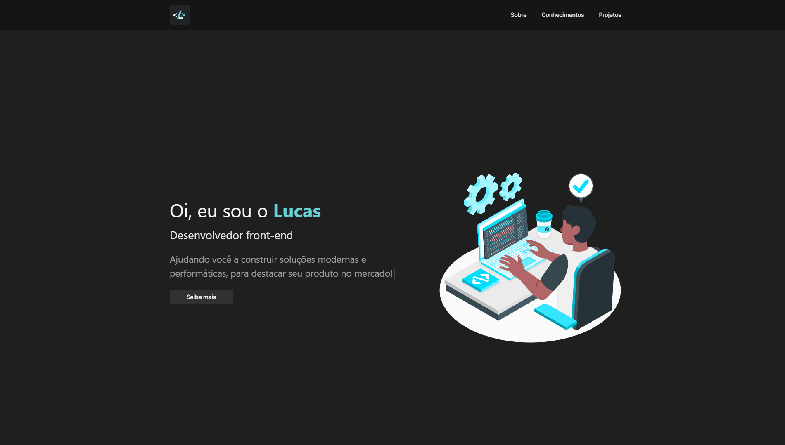

<h1 align="center">Portfólio - Lucas P</h1>

Este é o projeto do meu portfólio pessoal

 

## O Projeto 👨🏼‍💻

Este projeto é o meu portfólio pessoal, não tem nada de muito inovador, mas queria botar em prática alguns conhecimentos que andei adquirindo com o tempo, principlamente a utilização do SSR (Server Side Rendering) do NextJS. Também realizei o mockup do projeto no figma, que estará mais abaixo. Pretendo constantemente manter o projeto bem otimizado e sempre incrementar algo novo que eu aprender.

 

## Tecnologias 🔧

- TypeScript
- NextJS
- Chackra UI
- CSS
- Cypress
- Jest
- Font Awesome
- Framer Motion

## Deploy 🚀

 O deploy da aplicação foi realizado na Vercel, sem problemas

[lucascode.dev](https://lucascode.dev)

 

## Licença 📝

[MIT](https://github.com/hash-luk/portfolio-lucas-p/blob/main/LICENSE)

## Final 🏁

Espero que achem o projeto interessante, agregou bastante em questão de conhecimento, pois tive que aprender muito sobre como as coisas se comportam quando a renderização é realizada do lado do servidor.

#

<h4 align='center'> Desenvolvido com 💜 por Lucas P </h4>
